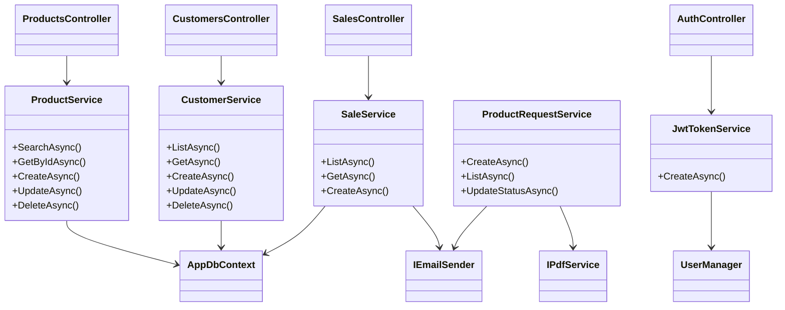

# ProjectFirmeza

End-to-end solution to manage products, customers, and sales with a shared PostgreSQL database, a secure REST API, an admin Razor portal, and an Angular SPA for customers.

## Solution Layout
| Project | Description |
| --- | --- |
| `Firmeza.Api` | ASP.NET Core 8 Web API (JWT + Identity + EF Core + PostgreSQL + MailKit) used by all clients. |
| `Firmeza.Web` | Razor admin portal reusing the same DbContext for dashboards, catalogs, and approvals. |
| `firmeza-client` | Angular 18 customer portal (catalog, cart, checkout, notifications, profile). |
| `Firmeza.Tests` | xUnit tests that validate service logic (EF Core InMemory). |

Dockerfiles plus `docker-compose.yml` spin up PostgreSQL, API, admin site, and SPA with one command.

## Firmeza.Api (REST)
### Capabilities
- CRUD for products/customers with filters, pagination, and soft validations (no delete when sales exist).
- Sales workflow updates stock, records who created the sale, and triggers confirmation emails.
- Auth stack: Identity + JWT, `SuperAdmin`/`Admin` policies, and customer self-registration.
- Product requests created by the SPA can be approved in the admin portal; approval creates a sale, updates stock, and now emails the customer a PDF receipt generated on the fly.
- Swagger UI protected with JWT “Authorize” button.

### Frequently Used Endpoints
| Method | Route | Notes |
| --- | --- | --- |
| POST | `/api/auth/register` | Creates Identity user + Customer row, returns JWT. |
| POST | `/api/auth/login` | Returns JWT + expiration. |
| GET | `/api/auth/me` | Basic profile for the current token. |
| GET | `/api/products` | Filterable catalog (auth required). |
| POST/PUT/DELETE | `/api/products/{id}` | `RequireAdmin`. |
| CRUD | `/api/customers` | Admin-only management. |
| POST | `/api/sales` | Any authenticated user; stock decreases and confirmation email fires. |
| GET | `/api/sales` | Admin report. |
| POST | `/api/notifications` | Customers request products; approvals now attach PDF receipts. |

### Configuration
- PostgreSQL: `ConnectionStrings__Default`.
- JWT: `Jwt__Issuer`, `Jwt__Audience`, `Jwt__SigningKey`, `Jwt__ExpirationMinutes`.
- SMTP: `Email__*` (defaults to Gmail; replace in production).
- Client URLs: `Client:BaseUrl`, `Client:ResetPath`.
- Admin seed credentials: `Seed__AdminEmail`, `Seed__AdminPassword`.

`appsettings.Development.json` overrides local values; `.env` variables are loaded automatically while debugging.

### Run Locally
```bash
DOTNET_SYSTEM_GLOBALIZATION_INVARIANT=1 dotnet restore
dotnet run --project Firmeza.Api        # https://localhost:7053 / http://localhost:5053
dotnet run --project Firmeza.Web        # https://localhost:7041 / http://localhost:5065
```
Swagger lives under `/swagger`. Use the “Authorize” button with `Bearer {token}`.

## Admin Portal (Firmeza.Web)
- Razor UI for admins to manage products, customers, sales, approvals, chatbot settings, etc.
- Customer requests go through `ProductRequestService`: when an admin approves, the service creates a sale, decrements stock, and emails the customer with the PDF receipt attached.
- Reusable helpers (`DateTimeExtensions`, Excel/PDF services) keep exports and receipts in sync with local time.
- Same Identity database as the API, so sessions are shared.

### Run Locally
```bash
dotnet run --project Firmeza.Web
# default ports: https://localhost:7041 / http://localhost:5065
```

## Customer SPA (firmeza-client)
### Highlights
- Angular 18 + Bootstrap 5 + RxJS.
- Auth service stores JWT in localStorage, exposes guards/interceptors, auto-signs out when expired.
- Catalog filters active products and respects stock levels. Cart stores items locally and calculates subtotal/taxes (16%).
- Checkout posts to `/api/sales`; upon success the cart clears, the API sends confirmation + PDF, and notifications update.
- Profile screen lets the customer update full name/email/phone; the session gets refreshed client-side and server-side (API updates all entries sharing that email).
- Notifications screen polls `/api/notifications` and surfaces approvals/rejections.

### Run Locally
```bash
cd firmeza-client
npm install
npm start             # http://localhost:4200 (expects API at http://localhost:5053/api)
```
Use `npm test` to run Jasmine/Karma specs (`CartService` sample included).

## Tests
```bash
dotnet test                # Runs Firmeza.Tests
npm test --prefix firmeza-client
```

## Docker
```bash
# Ensure JWT_SIGNING_KEY and DB credentials are set
docker compose up --build
# API -> http://localhost:5000, Web -> http://localhost:5100, SPA -> http://localhost:4200
```
Each Dockerfile performs a multi-stage publish so the final images are production ready.

## Diagrams
### ERD


### API Responsibilities


## Roadmap Ideas
- Track schema with EF Core migrations.
- Extend automated tests (Sales, Auth, Angular components).
- Add health checks, structured logging, and metrics exporters.
