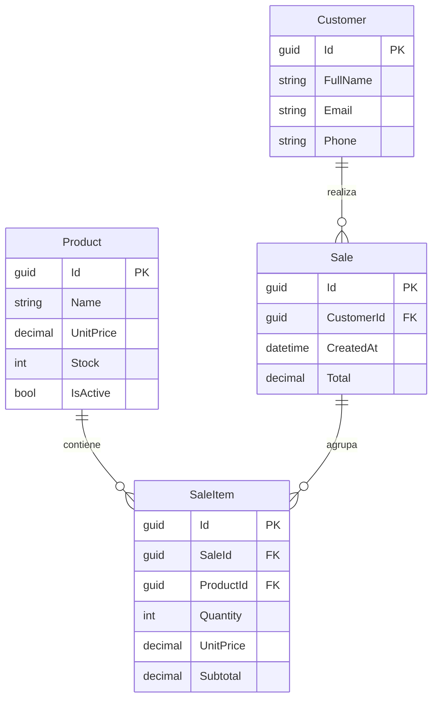
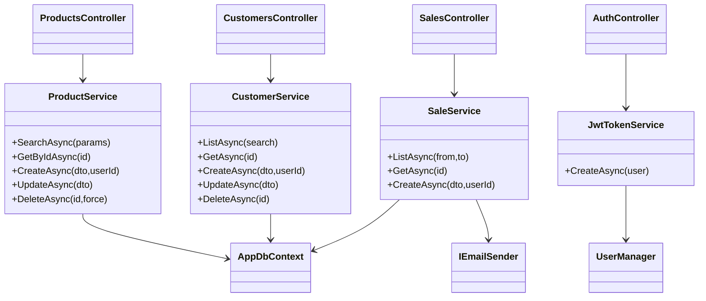

# ProjectFirmeza

API REST y aplicación Razor para administrar productos, clientes y ventas. Esta iteración agrega la capa Firmeza.Api para que otros módulos (Blazor, apps móviles) consuman la misma base de datos PostgreSQL y compartan reglas de negocio.

## Arquitectura rápida
- **Firmeza.Api**: ASP.NET Core 8, Entity Framework Core + PostgreSQL, Identity + JWT, AutoMapper, MailKit para SMTP.
- **Firmeza.Web**: módulo Razor existente reutilizando la misma base de datos.
- **Firmeza.Tests**: proyecto xUnit con pruebas unitarias de servicios.
- **Infraestructura**: Dockerfiles listos y `docker-compose.yml` que levanta PostgreSQL + API + Web.

## API principal (Firmeza.Api)
### Características clave
- CRUD completo de productos con filtros por nombre, disponibilidad, rango de precios y ordenamiento.
- CRUD de clientes y validaciones para evitar eliminar registros con ventas asociadas.
- Gestión de ventas con actualización automática de stock y envío opcional de correos de confirmación (SMTP Gmail por defecto).
- Identidad + JWT con roles `SuperAdmin` y `Admin`. Los clientes se registran vía `/api/auth/register` y reciben token listo para consumir la API.
- AutoMapper y DTOs para exponer sólo los datos necesarios en las respuestas.
- Swagger + JWT: UI protegida con botón "Authorize" para probar endpoints autenticados.

### Endpoints relevantes
| Recurso | Método | Ruta | Notas |
| --- | --- | --- | --- |
| Auth | POST | `/api/auth/register` | Alta de usuario final + Customer + token inmediato.
| Auth | POST | `/api/auth/login` | Devuelve token JWT.
| Auth | GET | `/api/auth/me` | Datos del usuario basado en el token.
| Productos | GET | `/api/products` | Paginado con filtros (`search`, `onlyAvailable`, `minPrice`, `maxPrice`), requiere estar autenticado (sin rol específico).
| Productos | POST/PUT/DELETE | `/api/products/{id}` | Sólo políticas `RequireAdmin`.
| Clientes | CRUD | `/api/customers` | Restringido a administradores.
| Ventas | POST | `/api/sales` | Disponible para cualquier usuario autenticado, descuenta stock y envía correo.
| Ventas | GET | `/api/sales` | Reporte histórico sólo para administradores.

### Autenticación y roles
1. Registrar cliente: `POST /api/auth/register` → token inmediato.
2. Login: `POST /api/auth/login` → token + expiración (configurable en `Jwt:ExpirationMinutes`).
3. Consumir endpoints agregando header `Authorization: Bearer {token}`.
4. Políticas:
   - `RequireAdmin`: `Admin` o `SuperAdmin`.
   - Algunos endpoints (productos GET, crear ventas) aceptan cualquier usuario autenticado (sin rol).

### Configuración (variables/env)
| Clave | Descripción |
| --- | --- |
| `ConnectionStrings__Default` | Cadena completa hacia PostgreSQL. Debe apuntar a la misma BD que Razor.
| `Jwt__Issuer`, `Jwt__Audience`, `Jwt__SigningKey`, `Jwt__ExpirationMinutes` | Parámetros del token JWT.
| `Email__*` | Datos SMTP (por defecto Gmail). Cambia `Host`, `Port`, `User`, `Password` para usar un servidor corporativo.
| `Seed__AdminEmail`, `Seed__AdminPassword` | Credenciales del super admin inicial.

El archivo `appsettings.json` incluye valores de referencia y `appsettings.Development.json` redefine la cadena local.

### Ejecución local (CLI)
```bash
# Restaurar dependencias
DOTNET_SYSTEM_GLOBALIZATION_INVARIANT=1 dotnet restore

# Lanzar API (puerto 5053 por defecto en launchSettings)
dotnet run --project Firmeza.Api

# Ejecutar Razor Web (opcional)
dotnet run --project Firmeza.Web
```
> Nota: si usas `ConnectionStrings__Default` vía `.env`, la API la detecta automáticamente (se carga con DotNetEnv en Development).

### Swagger / documentación interactiva
- URL: `https://localhost:7053/swagger` (o el puerto configurado).
- Usa el botón **Authorize** e ingresa `Bearer {token}` para probar endpoints.
- El archivo `Firmeza.Api/Firmeza.Api.http` contiene ejemplos para VS/REST Client (registro, login, productos).

### Emails SMTP
- Se implementó `IEmailSender` con MailKit (`MailKitEmailSender`) y una alternativa `NullEmailSender` para entornos sin SMTP.
- Puedes reemplazar el servidor cambiando las claves `Email__*` sin tocar código.
- Al crear una venta se envía un correo con el detalle (si el cliente tiene email configurado).

## Pruebas automatizadas (xUnit)
- Proyecto: `Firmeza.Tests`.
- Incluye una prueba de `ProductService` que valida el filtrado de disponibilidad utilizando `Microsoft.EntityFrameworkCore.InMemory`.
- Ejecutar todas las pruebas:
```bash
dotnet test
```

## Docker y despliegue inicial
1. Ajusta `JWT_SIGNING_KEY` antes de publicar (variable usada en `docker-compose`).
2. Levanta todo el entorno (PostgreSQL + API + Web) con:
```bash
docker compose up --build
```
3. Servicios expuestos:
   - API: `http://localhost:5000`
   - Web (Razor): `http://localhost:5100`
   - PostgreSQL: puerto `5432` (usuario/password `postgres`).
4. Los Dockerfiles de `Firmeza.Api` y `Firmeza.Web` usan build multi-stage (`dotnet publish`) listos para ambientes productivos.

## Diagramas técnicos
### Modelo Entidad-Relación


### Diagrama de clases/responsabilidades (API)


## Próximos pasos sugeridos
- Agregar migraciones de EF Core para versionar el esquema.
- Crear más pruebas unitarias/e2e (por ejemplo para `SaleService` y `AuthController`).
- Integrar observabilidad (Health Checks, logging estructurado) antes del despliegue productivo.
