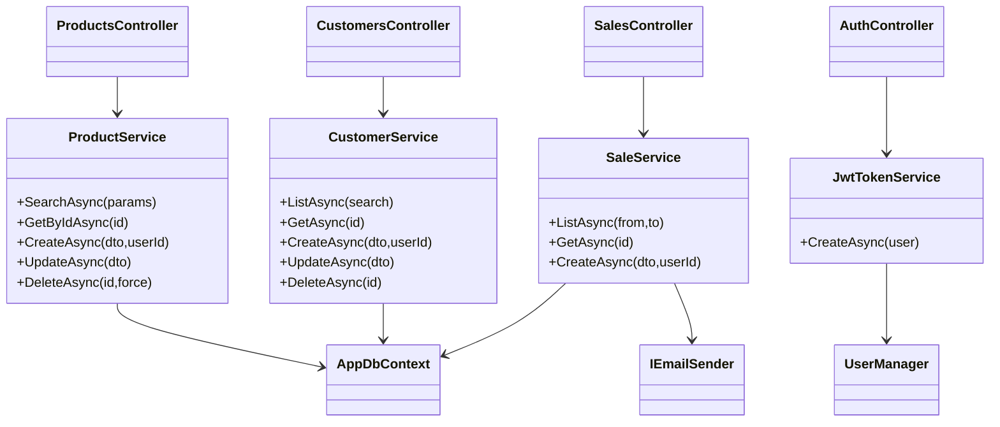

# ProjectFirmeza

REST API plus Razor front-end to manage products, customers, and sales. This iteration introduces the Firmeza.Api layer so other modules (Blazor, mobile apps) can consume the same PostgreSQL database and share business logic.

## Architecture at a Glance
- **Firmeza.Api**: ASP.NET Core 8, Entity Framework Core + PostgreSQL, Identity + JWT, AutoMapper, MailKit for SMTP.
- **Firmeza.Web**: existing Razor module that reuses the same database.
- **Firmeza.Tests**: xUnit project with unit tests over core services.
- **Infrastructure**: ready-to-use Dockerfiles and `docker-compose.yml` to spin up PostgreSQL + API + Web.

## Core API (Firmeza.Api)
### Highlights
- Full CRUD for products with filters (search, availability, price range, sorting).
- Customer CRUD with validations to avoid deleting records that still have sales.
- Sales management updates stock automatically and can send confirmation emails (Gmail SMTP by default).
- Identity + JWT with `SuperAdmin` and `Admin` roles. End users self-register via `/api/auth/register` and get a token immediately (no extra role required).
- AutoMapper + DTOs expose only the data needed by clients.
- Swagger + JWT: UI secured with “Authorize” button to test protected endpoints.

### Key Endpoints
| Resource | Method | Route | Notes |
| --- | --- | --- | --- |
| Auth | POST | `/api/auth/register` | Creates the user + customer entry and issues a token.
| Auth | POST | `/api/auth/login` | Returns a JWT token.
| Auth | GET | `/api/auth/me` | User info based on the current token.
| Products | GET | `/api/products` | Paged list with filters; requires authentication only.
| Products | POST/PUT/DELETE | `/api/products/{id}` | Restricted to the `RequireAdmin` policy.
| Customers | CRUD | `/api/customers` | Admin-only area.
| Sales | POST | `/api/sales` | Any authenticated user can create a sale; stock is updated and email can be sent.
| Sales | GET | `/api/sales` | Historical report for administrators.

### Authentication and Roles
1. Register: `POST /api/auth/register` → immediate token.
2. Login: `POST /api/auth/login` → token + expiration (configured under `Jwt:ExpirationMinutes`).
3. Call endpoints using `Authorization: Bearer {token}`.
4. Policies:
   - `RequireAdmin`: user must be `Admin` or `SuperAdmin`.
   - Some endpoints (e.g., `GET /api/products`, `POST /api/sales`) only need the user to be authenticated.

### Configuration (env/appsettings)
| Key | Description |
| --- | --- |
| `ConnectionStrings__Default` | Full PostgreSQL connection string (shared with Razor app).
| `Jwt__Issuer`, `Jwt__Audience`, `Jwt__SigningKey`, `Jwt__ExpirationMinutes` | JWT parameters.
| `Email__*` | SMTP settings (defaults to Gmail). Replace host/credentials for corporate SMTP.
| `Seed__AdminEmail`, `Seed__AdminPassword` | Initial admin credentials.

`appsettings.json` holds reference values; `appsettings.Development.json` overrides the local connection string.

### Local Run (CLI)
```bash
# Restore dependencies
DOTNET_SYSTEM_GLOBALIZATION_INVARIANT=1 dotnet restore

# Run API (defaults to port 5053 per launchSettings)
dotnet run --project Firmeza.Api

# Optionally run the Razor site
dotnet run --project Firmeza.Web
```
> Tip: when `ConnectionStrings__Default` is defined via `.env`, the API loads it automatically (DotNetEnv in Development).

### Swagger / Interactive Docs
- URL: `https://localhost:7053/swagger` (or the configured port).
- Press **Authorize** and paste `Bearer {token}` to exercise protected endpoints.
- `Firmeza.Api/Firmeza.Api.http` ships sample requests (register, login, product CRUD).

### SMTP Emails
- `IEmailSender` implemented with MailKit (`MailKitEmailSender`) and a `NullEmailSender` fallback.
- Swap SMTP servers by changing `Email__*` values—no code changes required.
- When a sale is created, a confirmation email is sent if the customer has an email address.

## Automated Tests (xUnit)
- Project: `Firmeza.Tests`.
- Contains a sample `ProductService` test validating the “only available” filter using EF Core InMemory.
- Run all tests with:
```bash
dotnet test
```

## Docker & Deployment Draft
1. Set a secure `JWT_SIGNING_KEY` before publishing (used by `docker-compose`).
2. Bring up PostgreSQL + API + Web:
```bash
docker compose up --build
```
3. Exposed services:
   - API: `http://localhost:5000`
   - Razor Web: `http://localhost:5100`
   - PostgreSQL: `localhost:5432` (user/password `postgres`).
4. Dockerfiles for both projects use multi-stage `dotnet publish`, suitable for production images.

## Technical Diagrams
### Entity-Relationship Model


### Class/Responsibility Diagram (API)


## Next Steps
- Add EF Core migrations to version-control the schema.
- Expand unit/end-to-end tests (e.g., `SaleService`, `AuthController`).
- Integrate observability (health checks, structured logging) before production rollout.
